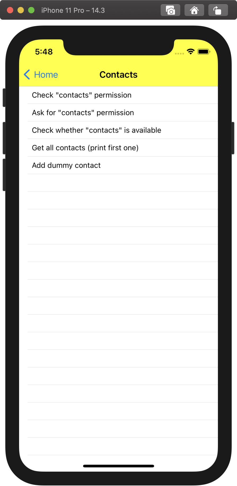

# React demo

<p align="center">
    
</p>

## Running the app

### Prerequisites

1. Ensure that you have followed the initial monorepo setup steps (`npm run setup` and `npm start`, selecting `@nativescript-community.build-all`, in the root directory of the monorepo).
2. Ensure you [have your environment set up for NativeScript development](https://react-nativescript.netlify.app/docs/getting-started/installation).
3. Run one of the following commands to build (if not yet built) and run the iOS app, depending on where you'd prefer your terminal to be focused:

### If your terminal is in `demo-react`

#### iOS

```sh
# Full NativeScript CLI options here: https://docs.nativescript.org/tooling/docs-cli/start
ns run ios
```

And if you then receive an error like this:

> Unable to apply changes on device: F5922E41-5D17-4E9F-A2F8-ADBCB4F11542. Error is: Command xcodebuild failed with exit code 65.

... It's a pending problem with NativeScript supporting Xcode 12.3. Once `platforms/internal/nativescript-build.xcconfig` has been generated, please add `VALIDATE_WORKSPACE = YES` to it as detailed in [NativeScript issue 9097](https://github.com/NativeScript/NativeScript/issues/9097). Once the [NativeScript iOS V8 runtime PR 92](https://github.com/NativeScript/ns-v8ios-runtime/pull/92/files) has been merged, that change will be handled for you automatically.

Until that PR lands, you will need to restore this patch any time you run `ns run clean`, of course!

#### Android

Android support is incomplete, so the equivalent `ns run android` command won't be of much use right now.

### If your terminal is in the root of the monorepo

#### iOS

You can alternatively use the nx workspace's convenience command, which simply runs `ns run ios` under-the-hood:

```sh
npm start
# Select: apps.demo-react.ios
```

And if you then receive an error like this:

> Unable to apply changes on device: F5922E41-5D17-4E9F-A2F8-ADBCB4F11542. Error is: Command xcodebuild failed with exit code 65.

... It's a pending problem with NativeScript supporting Xcode 12.3. Once `platforms/internal/nativescript-build.xcconfig` has been generated, please add `VALIDATE_WORKSPACE = YES` to it as detailed in [NativeScript issue 9097](https://github.com/NativeScript/NativeScript/issues/9097). Once the [NativeScript iOS V8 runtime PR 92](https://github.com/NativeScript/ns-v8ios-runtime/pull/92/files) has been merged, that change will be handled for you automatically.

Until that PR lands, you will need to restore this patch any time you run `ns run clean`, of course!

#### Android

Android support is incomplete, so the equivalent `apps.demo-react.android` command won't be of much use right now.